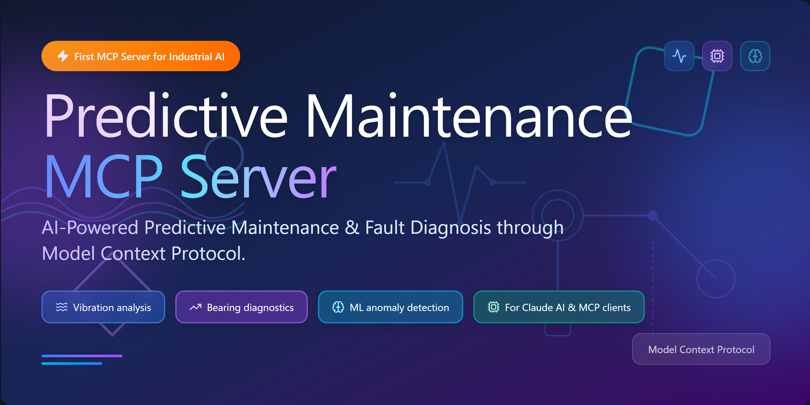
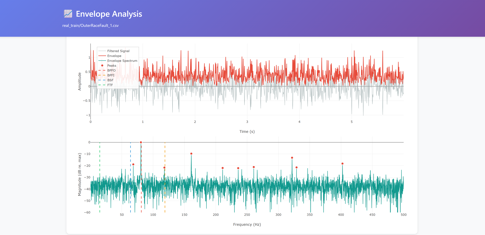
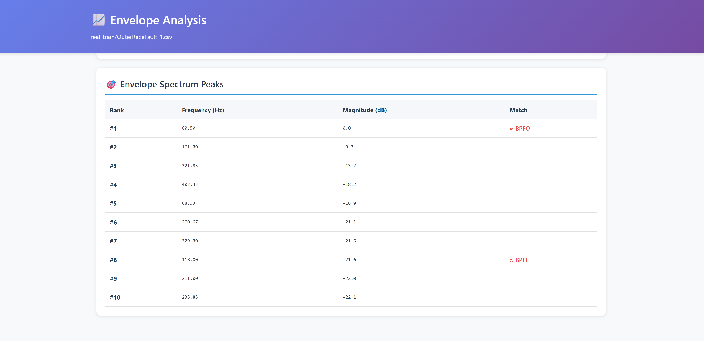
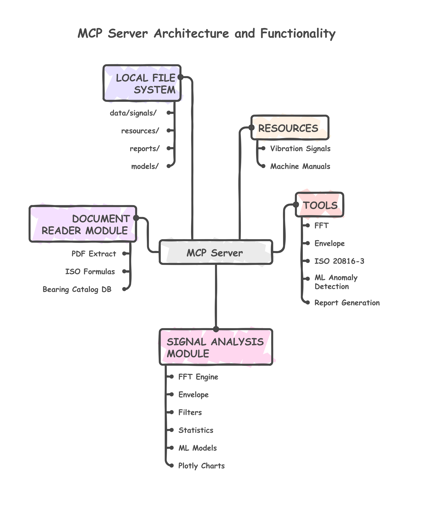

# Predictive Maintenance MCP Server

<!-- mcp-name: io.github.LGDiMaggio/predictive-maintenance-mcp -->

[](https://www.python.org/downloads/)
[](https://doi.org/10.5281/zenodo.17611542)
[](https://github.com/LGDiMaggio/predictive-maintenance-mcp/actions/workflows/tests.yml)
[](https://codecov.io/gh/LGDiMaggio/predictive-maintenance-mcp)
[](https://github.com/jlowin/fastmcp)
[](https://opensource.org/licenses/MIT)
[](https://www.linkedin.com/in/luigi-gianpio-di-maggio)

> **Transform raw vibration data into actionable maintenance insights through natural conversation with AI.**

A [Model Context Protocol](https://modelcontextprotocol.io/) server that brings **industrial machinery diagnostics** directly to LLMs like Claude, enabling AI-powered vibration analysis, bearing fault detection, and predictive maintenance workflows — all through natural language.

**48 MCP endpoints** | **ISO 13374 architecture** | **Claude Code plugin** | **86% test coverage** | **Privacy-first**



---

## Why This Exists

Predictive maintenance is critical for Industry 4.0, yet expert-level machinery diagnostics remains inaccessible to most engineers. Complex diagnostic workflows — FFT spectrum analysis, envelope demodulation, ISO severity assessment — require years of specialized training.

**We believe that AI can democratize this expertise.**

By combining the reasoning capabilities of Large Language Models with specialized diagnostic tools through the Model Context Protocol (MCP), we create a bridge: engineers can describe a problem in plain language and receive professional-grade analysis. No signal processing PhD required.

This project is an **open-source framework** that proves this vision works. Recently refactored from a monolithic prototype into a **modular, standards-compliant platform** organized around the ISO 13374 Six-Block Diagnostic Architecture — with a full Claude Code plugin for guided workflows.

> Read the full story: [Building an AI-Powered Predictive Maintenance System with MCP and Claude](https://medium.com/@luigigianpio.dimaggio/building-an-ai-powered-predictive-maintenance-system-with-model-context-protocol-and-claude-1b0ed588e574)

---

## How It Works

```
                        YOU
          "Is this bearing failing?"
                        |
                        v
              LLM (Claude, GPT, Ollama...)
          Understands your question, selects tools
                        |
                        v  Model Context Protocol (MCP)
    +-----------------------------------------+
    |   PREDICTIVE MAINTENANCE MCP SERVER      |
    |                                         |
    |   40 Tools  |  4 Prompts  |  4 Resources |
    |                                         |
    |   Signal Processing  |  Diagnostics     |
    |   ML Anomaly Det.    |  ISO Compliance  |
    |   RAG Doc Search     |  Report Gen.     |
    +-----------------------------------------+
                        |
                        v
              YOUR DATA (stays local)
    Vibration signals | Equipment manuals | ML models
```

**Key insight**: The LLM doesn't know signal processing. It knows how to *call tools* that do signal processing. MCP is the standard that makes this plug-and-play.

- **Plug-and-play** — Add new analysis tools as Python functions; the LLM discovers them automatically
- **Local processing** — Raw signals never leave your machine; only computed results (peaks, RMS, diagnoses) flow to the LLM. Use a [local LLM](https://ollama.com/) for full air-gapped privacy
- **LLM-agnostic** — Works with Claude, ChatGPT, **Microsoft Copilot Studio**, or any MCP-compatible client
- **Enterprise-ready** — Deploy as HTTPS server (SSE transport) for corporate environments — [with or without Docker](docs/DEPLOYMENT.md)
- **Modular** — Use only the tools you need, extend with your own

---

## Table of Contents

- [How It Works](#how-it-works)
- [Choose Your Path](#choose-your-path)
- [What Makes This Special](#what-makes-this-special)
- [Quick Examples](#quick-examples)
- [Installation](#installation)
- [Configuration](#configuration)
- [Available Tools & Resources (48 Endpoints)](#available-tools--resources)
- [Claude Code Plugin](#claude-code-plugin)
- [Architecture](#architecture)
- [Sample Dataset](#sample-dataset)
- [Usage Examples](#usage-examples)
- [Professional Reports](#professional-reports)
- [Documentation](#documentation)
- [Testing](#testing)
- [Development](#development)
- [Roadmap](#roadmap)
- [Contributing](#contributing)
- [License](#license)
- [Citation](#citation)

---

## Choose Your Path

This project serves two audiences. Pick the path that fits you:

<table>
<tr>
<td width="50%" valign="top">

### I'm a Maintenance / Reliability Engineer

*"I want to use AI for my vibration analysis and diagnostics."*

**You don't need to write code.** This tool turns your vibration data into professional reports through simple conversation.

**What you'll get:**
- ISO 20816-3 compliance reports in one sentence
- Bearing fault detection from your real data
- Interactive HTML reports you can share with your team
- ML anomaly detection trained on your healthy baselines

**Start here**: [**Quickstart for Engineers**](docs/QUICKSTART_ENGINEER.md)

</td>
<td width="50%" valign="top">

### I'm an AI / Software Developer

*"I want to understand MCP, extend this server, or build my own."*

**The code is your playground.** Learn how MCP works, add new diagnostic tools, or use this as a template for your own domain-specific server.

**What you'll learn:**
- How MCP bridges LLMs and specialized tools
- How to create new tools as Python functions
- How the ISO 13374 modular architecture works
- How to build and distribute Claude Code plugins

**Start here**: [**Quickstart for Developers**](docs/QUICKSTART_DEVELOPER.md)

</td>
</tr>
</table>

> Don't fit either profile? Read on for the full documentation, or jump to [Quick Examples](#quick-examples) to see the server in action.

---

## What Makes This Special

- **48 MCP Endpoints** — 40 tools + 4 guided prompts + 4 resources, organized by ISO 13374 diagnostic blocks
- **Real Bearing Fault Data Included** — 20 production-quality vibration signals from real machinery tests (3 healthy, 17 faulty)
- **Claude Code Plugin** — 7 domain skills, 2 autonomous agents, 3 slash commands — installable from the marketplace
- **ISO 13374 Modular Architecture** — Codebase organized into signal acquisition, processing, diagnostics, prognostics, and decision support sub-packages
- **Professional Reports** — Interactive Plotly HTML visualizations + structured Word (.docx) diagnostic reports
- **ISO 20816-3 Compliance** — Industry-standard vibration severity assessment built-in
  
- **Advanced Diagnostics** — FFT spectrum, envelope analysis, PSD, STFT spectrograms, time-domain features
  <details>
  <summary><b>Example analysis</b></summary>

  
  
  

  </details>
- **ML Anomaly Detection** — Train OneClassSVM/LOF on healthy baselines with optional hyperparameter tuning
- **Multi-Format Support** — Load signals from CSV, MAT (MATLAB), WAV, NPY, and Parquet files
- **RAG Document Search** — Vector search (FAISS + sentence-transformers) with TF-IDF fallback over machine manuals and bearing catalogs
- **86% Test Coverage** — Comprehensive test suite across Windows, macOS, and Linux with CI/CD on GitHub Actions
- **Multi-Transport** — stdio (Claude Desktop), SSE, and Streamable-HTTP for enterprise deployment

---

## Quick Examples

### Example 1: Bearing Fault Detection

```
Generate envelope report for real_train/OuterRaceFault_1.csv
```

**Result**: AI automatically:
1. Detects sampling rate from metadata (97,656 Hz)
2. Applies bandpass filter (500-5000 Hz)
3. Generates interactive HTML report with bearing fault frequencies marked
4. Identifies outer race fault at ~81 Hz with harmonics
5. Saves report to `reports/envelope_OuterRaceFault_1_*.html`

### Example 2: ISO 20816-3 Vibration Assessment

```
Evaluate real_train/OuterRaceFault_1.csv against ISO 20816-3 standard
```

**Result**:
- RMS velocity: 4.5 mm/s -> Zone B (Acceptable for long-term operation)
- Interactive HTML report with zone visualization
- Compliance assessment and recommendations

### Example 3: Machine Manual Integration + Diagnosis

```
1. Extract specifications from test_pump_manual.pdf
2. Calculate bearing frequencies for SKF 6205-2RS at 1475 RPM
3. Diagnose bearing fault in signal_from_pump.csv using calculated frequencies
```

**Result**: Complete zero-knowledge diagnosis:
- Extracts: Drive end bearing SKF 6205-2RS, operating speed 1475 RPM
- Calculates: BPFO=85.20 Hz, BPFI=136.05 Hz, BSF=101.32 Hz
- Diagnoses: Outer race fault detected with 3 harmonics

More examples: See [Usage Examples](#usage-examples) below or [EXAMPLES.md](EXAMPLES.md) for complete workflows

---

## Installation

### Option A — PyPI (recommended)

```bash
pip install predictive-maintenance-mcp
```

Optional extras for advanced features:

```bash
pip install predictive-maintenance-mcp[full]        # Everything
pip install predictive-maintenance-mcp[vector-search] # FAISS semantic search
pip install predictive-maintenance-mcp[ml]           # ML anomaly detection
pip install predictive-maintenance-mcp[docx]         # Word report generation
pip install predictive-maintenance-mcp[ocr]          # OCR for scanned PDFs
pip install predictive-maintenance-mcp[sse]          # SSE/HTTP transport
```

### Option B — From Source (development)

```bash
git clone https://github.com/LGDiMaggio/predictive-maintenance-mcp.git
cd predictive-maintenance-mcp
pip install -e ".[dev]"
```

### Run the Server

```bash
# Default: stdio transport (Claude Desktop, VS Code)
predictive-maintenance-mcp

# SSE transport for remote/enterprise clients (Copilot Studio, networked)
predictive-maintenance-mcp --transport sse --host 0.0.0.0 --port 8080

# Docker (SSE mode by default)
docker compose up -d
```

Detailed Installation Guide: See [INSTALL.md](INSTALL.md) for troubleshooting and advanced setup.
HTTPS Deployment & Copilot Studio: See [DEPLOYMENT.md](docs/DEPLOYMENT.md) for enterprise deployment.

---

## Configuration

### Claude Desktop

Add to your Claude Desktop config:
- **Windows**: `%APPDATA%\Claude\claude_desktop_config.json`
- **macOS**: `~/Library/Application Support/Claude/claude_desktop_config.json`

**If installed via pip** (recommended):

```json
{
  "mcpServers": {
    "predictive-maintenance": {
      "command": "predictive-maintenance-mcp"
    }
  }
}
```

**If running from source** (local dev):

```json
{
  "mcpServers": {
    "predictive-maintenance": {
      "command": "C:/path/to/predictive-maintenance-mcp/.venv/Scripts/python.exe",
      "args": ["-m", "predictive_maintenance_mcp"],
      "env": {
        "PDM_PROJECT_DIR": "C:/path/to/predictive-maintenance-mcp"
      }
    }
  }
}
```

> **Notes**:
> - Replace `C:/path/to/predictive-maintenance-mcp` with your actual project path
> - Use **absolute paths** — forward slashes (`/`) work on all platforms, including Windows
> - On macOS/Linux, use `.venv/bin/python` instead of `.venv/Scripts/python.exe`
> - The `PDM_PROJECT_DIR` env var tells the server where to find `data/`, `models/`, and `reports/`

After configuration, **restart Claude Desktop** completely.

### VS Code

Add to your MCP configuration (`.vscode/mcp.json` or user settings):

**If installed via pip** (recommended):

```json
{
  "servers": {
    "predictive-maintenance": {
      "type": "stdio",
      "command": "predictive-maintenance-mcp"
    }
  }
}
```

**If running from source** (local dev):

```json
{
  "servers": {
    "predictive-maintenance": {
      "type": "stdio",
      "command": "/path/to/predictive-maintenance-mcp/.venv/bin/python",
      "args": ["-m", "predictive_maintenance_mcp"],
      "env": {
        "PDM_PROJECT_DIR": "/path/to/predictive-maintenance-mcp"
      }
    }
  }
}
```

> Use `.venv/Scripts/python.exe` on Windows.

---

## Available Tools & Resources

**48 MCP endpoints** organized by the ISO 13374 Six-Block Diagnostic Architecture:

### Block 1: Signal Acquisition (6 tools + 2 resources)

| Endpoint | Type | Description |
|----------|------|-------------|
| `load_signal` | Tool | Load vibration file into memory cache |
| `list_signals` | Tool | Browse available signal files with metadata |
| `list_stored_signals` | Tool | List cached signals in memory |
| `get_signal_info` | Tool | Get signal metadata (sampling rate, duration, stats) |
| `generate_test_signal` | Tool | Create synthetic vibration signals for testing |
| `clear_signal` / `clear_all_signals` | Tool | Cache management |
| `signal://list` | Resource | Browse all available signal files |
| `signal://read/{filename}` | Resource | Read signal metadata + statistics |

### Block 2: Signal Processing & Analysis (7 tools)

| Tool | Description |
|------|-------------|
| `analyze_fft` | FFT spectrum analysis with automatic peak detection |
| `analyze_envelope` | Envelope analysis (Hilbert demodulation) for bearing faults |
| `analyze_statistics` | Time-domain features (RMS, kurtosis, crest factor, entropy) |
| `compute_power_spectral_density` | Welch's method PSD |
| `compute_spectrogram_stft` | STFT time-frequency spectrogram |
| `extract_features_from_signal` | 17+ statistical & spectral features |
| `plot_signal` / `plot_spectrum` / `plot_envelope` | Visualization tools |

### Blocks 3-4: Diagnostics & Health Assessment (14 tools)

<details>
<summary><b>Bearing Diagnostics</b></summary>

| Tool | Description |
|------|-------------|
| `calculate_bearing_characteristic_frequencies` | Compute BPFO/BPFI/BSF/FTF |
| `check_bearing_fault_peak_tool` | Detect peaks at fault frequencies |
| `check_bearing_faults_direct` | Multi-fault detection (inner/outer/ball/cage) |
| `diagnose_bearing` | Guided 6-step bearing diagnostic workflow |
| `search_bearing_catalog` | Lookup bearing specs by model |
| `lookup_bearing_and_compute_tool` | Combined catalog lookup + frequency calculation |

</details>

<details>
<summary><b>Gear Diagnostics & ISO Standards</b></summary>

| Tool | Description |
|------|-------------|
| `diagnose_gear` | Evidence-based gear fault detection |
| `evaluate_iso_20816` | ISO 20816-3 severity assessment (Zones A/B/C/D) |
| `assess_vibration_severity` | Vibration health classification |

</details>

<details>
<summary><b>ML Anomaly Detection</b></summary>

| Tool | Description |
|------|-------------|
| `train_anomaly_model` | Train novelty detection (OneClassSVM/LOF) on healthy data |
| `predict_anomalies` | Detect anomalies in new signals with confidence scores |

</details>

<details>
<summary><b>Documentation & RAG Search</b></summary>

| Endpoint | Type | Description |
|----------|------|-------------|
| `search_documentation` | Tool | Semantic RAG search (FAISS/TF-IDF) over manuals & catalogs |
| `read_manual_excerpt` | Tool | Read machine manual text |
| `extract_manual_specs` | Tool | Auto-extract bearing/RPM/power from manuals |
| `list_machine_manuals` | Tool | Browse available equipment documentation |
| `manual://list` | Resource | List available manuals |
| `manual://read/{filename}` | Resource | Read manual content |

</details>

### Block 6: Reporting & Decision Support (11 tools)

| Tool | Description |
|------|-------------|
| `generate_fft_report` | Interactive Plotly FFT HTML report |
| `generate_envelope_report` | Envelope analysis report with bearing markers |
| `generate_iso_report` | ISO 20816-3 severity zone visualization |
| `generate_diagnostic_report_docx` | Structured Word document report |
| `generate_pca_visualization_report` | 2D/3D PCA projection |
| `generate_feature_comparison_report` | Feature-level comparison across signals |
| `list_html_reports` | Browse generated HTML reports |
| `get_report_info` | Get report metadata without loading full HTML |

### Guided Workflows (4 MCP Prompts)

| Prompt | Description |
|--------|-------------|
| `diagnose_bearing_prompt` | Complete bearing fault diagnostic decision tree |
| `diagnose_gear_prompt` | Gear fault detection workflow |
| `quick_diagnostic_report_prompt` | Fast health screening |
| `analyze_anomalies_prompt` | ML-based anomaly detection tutorial |

---

## Claude Code Plugin

The project includes a **distributable Claude Code plugin** that brings domain-specific intelligence directly into your coding environment. The plugin wraps the MCP server's capabilities into guided skills, autonomous agents, and quick-access commands.

### Installation

**From the marketplace:**

```shell
/plugin marketplace add LGDiMaggio/predictive-maintenance-mcp
/plugin install predictive-maintenance@predictive-maintenance-marketplace
```

**Local development:**

```shell
/plugin marketplace add ./plugin
/plugin install predictive-maintenance@predictive-maintenance-marketplace
```

### Skills (7)

Skills activate automatically when Claude detects relevant context in your conversation:

| Skill | Triggers | Description |
|-------|----------|-------------|
| **bearing-diagnosis** | "diagnose bearing", "outer race fault" | Full bearing fault diagnostic workflow |
| **gear-diagnosis** | "gear fault", "gear mesh frequency" | Gear fault detection via spectral analysis |
| **quick-screening** | "quick check", "is this machine healthy" | Fast health screening (<30s) |
| **report-generation** | "generate report", "create PDF" | Professional HTML/DOCX report generation |
| **anomaly-detection** | "train model", "detect anomalies" | ML-based anomaly detection (SVM, LOF) |
| **signal-management** | "load signal", "generate test signal" | Signal loading, generation, cache management |
| **documentation-search** | "search manual", "look up bearing" | RAG search across manuals and catalogs |

### Agents (2)

Agents run autonomously for complex, multi-step tasks:

| Agent | When to Use | Description |
|-------|-------------|-------------|
| **diagnostic-pipeline** | "Run a full diagnostic on this signal" | Complete ISO 13374 pipeline: load -> analyze -> diagnose -> report |
| **signal-explorer** | "Explore these signals and compare them" | Signal characterization, comparison, and outlier detection |

### Commands (3)

Quick entry points for common workflows:

| Command | Usage | Description |
|---------|-------|-------------|
| `/pm-diagnose` | `/pm-diagnose bearing_001` | Start bearing fault diagnosis |
| `/pm-screen` | `/pm-screen bearing_001` | Quick health screening |
| `/pm-report` | `/pm-report bearing_001 full` | Generate diagnostic reports |

> **Note**: The Claude Code plugin requires the predictive-maintenance-mcp MCP server to be installed and connected. The plugin provides the domain expertise layer; the MCP server provides the computational engine.

---

## Architecture

The system follows a **modular ISO 13374 Six-Block Architecture**, recently refactored from a monolithic design into clear sub-packages:

```
src/predictive_maintenance_mcp/
|-- mcp_tools/              # MCP endpoint registration (48 endpoints)
|   |-- acquisition_tools.py    # Block 1: Signal loading & resources
|   |-- analysis_tools.py       # Block 2: FFT, envelope, STFT, features
|   |-- diagnostics_tools.py    # Blocks 3-4: Bearing, gear, ISO, ML
|   |-- report_tools.py         # Block 6: HTML/DOCX report generation
|   |-- prompts.py              # Guided diagnostic workflows
|   +-- _utils.py               # Shared utilities
|-- signal_acquisition/     # Multi-format loaders (CSV, MAT, WAV, NPY, Parquet)
|-- signal_processing/      # Pure spectral analysis & feature extraction
|-- diagnostics/            # Bearing/gear analysis, ISO standards
|-- decision_support/       # Evidence-based diagnosis pipeline
|-- prognostics/            # RUL estimation & trend analysis (Phase 2)
|-- rag.py                  # Document indexing & search (FAISS/TF-IDF)
|-- models.py               # Pydantic data models
|-- server.py               # FastMCP server configuration
+-- config.py               # Configuration management
```



<details>
<summary><b>Detailed Architecture Diagram</b></summary>

```
+-------------------------------------------------------------+
|                    CLAUDE / LLM CLIENT                       |
+--------------------+----------------------------------------+
                     |
                     v
+-------------------------------------------------------------+
|                   MCP SERVER (FastMCP)                       |
|  +------------------------------------------------------+   |
|  |  RESOURCES (Direct Data Access)                       |   |
|  |  - signal://list, signal://read/{filename}            |   |
|  |  - manual://list, manual://read/{filename}            |   |
|  +------------------------------------------------------+   |
|  +------------------------------------------------------+   |
|  |  TOOLS (40 Analysis & Processing Tools)               |   |
|  |  Block 1: Signal Acquisition (6)                      |   |
|  |  Block 2: Signal Processing (7)                       |   |
|  |  Blocks 3-4: Diagnostics & Health (14)                |   |
|  |  Block 6: Reporting (11)                              |   |
|  +------------------------------------------------------+   |
|  +------------------------------------------------------+   |
|  |  PROMPTS (4 Guided Workflows)                         |   |
|  |  Bearing diagnosis | Gear diagnosis                   |   |
|  |  Quick screening   | Anomaly detection                |   |
|  +------------------------------------------------------+   |
+--------------------+----------------------------------------+
                     |
        +------------+------------+
        v                         v
+------------------+   +----------------------------------+
|  SIGNAL ANALYSIS |   |  DOCUMENT READER MODULE           |
|  - FFT Engine    |   |  - PDF Extract (pypdf + OCR)     |
|  - Envelope      |   |  - ISO Formulas (BPFO/BPFI)     |
|  - Filters       |   |  - Bearing Catalog DB (20+)      |
|  - Statistics    |   |  - RAG Index (FAISS / TF-IDF)    |
|  - ML Models     |   +----------------------------------+
|  - Plotly Charts |
+--------+---------+
         |
         v
+-------------------------------------------------------------+
|                   LOCAL FILE SYSTEM                           |
|  data/signals/       | resources/machine_manuals/            |
|  data/real_bearings/ | resources/bearing_catalogs/            |
|  reports/            | models/ (trained ML models)            |
+-------------------------------------------------------------+
```

</details>

**Key Numbers:**
- 40 MCP Tools — Complete diagnostic workflow
- 4 MCP Prompts — Guided diagnostic workflows
- 4 MCP Resources — Direct read access to signals and manuals
- 7 Plugin Skills + 2 Agents + 3 Commands — Claude Code integration
- Hybrid Architecture — Resources for reading, Tools for processing
- Local-First — All data stays on your machine (privacy-preserving)

---

## Sample Dataset

The server includes **20 real bearing vibration signals** from production machinery:

**Training Set (14 signals)**:
- 2 Healthy Baselines — Normal operation data
- 7 Inner Race Faults — Variable load conditions
- 5 Outer Race Faults — Various severity levels

**Test Set (6 signals)**:
- 1 Healthy Baseline — Validation data
- 2 Inner Race Faults — Test conditions
- 3 Outer Race Faults — Test conditions

> **Note**: Sampling rates and durations vary by signal (48.8-97.7 kHz, 3-6 seconds). All parameters auto-detected from metadata files.

Full dataset documentation: [data/README.md](data/README.md)

---

## Usage Examples

### Quick Fault Detection

```
Diagnose bearing fault in real_train/OuterRaceFault_1.csv
BPFO=81.13 Hz, BPFI=118.88 Hz, BSF=63.91 Hz, FTF=14.84 Hz
```

**Result:** Outer race fault detected at ~81 Hz with harmonics

### Generate Professional Report

```
Generate envelope report for real_train/OuterRaceFault_1.csv
```

**Result:** Interactive HTML saved to `reports/` with bearing fault markers

### Train ML Anomaly Detector

```
Train anomaly model on baseline_1.csv and baseline_2.csv
Validate on OuterRaceFault_1.csv
```

**Result:** Model detects fault with 95%+ confidence

### Full Diagnostic with Claude Code Plugin

```
/pm-diagnose real_train/OuterRaceFault_1.csv
```

**Result:** The diagnostic-pipeline agent runs the complete ISO 13374 workflow: load signal -> FFT + envelope analysis -> bearing diagnosis -> ISO severity assessment -> generate HTML + DOCX reports

More examples: [EXAMPLES.md](EXAMPLES.md) for complete diagnostic workflows

---

## Professional Reports

All analysis tools generate **interactive HTML reports** with Plotly visualizations:

### Why HTML Reports?

- **Universal** — Works with any LLM (Claude, ChatGPT, local models)
- **Zero tokens** — Files saved locally, not in chat
- **Interactive** — Pan, zoom, hover for details
- **Professional** — Publication-ready visualizations
- **Persistent** — Save for documentation and sharing

### Report Types

| Report | Tool | Contents |
|--------|------|----------|
| FFT Spectrum | `generate_fft_report()` | Frequency analysis, peak detection, harmonic markers |
| Envelope Analysis | `generate_envelope_report()` | Bearing fault frequencies, modulation detection |
| ISO 20816-3 | `generate_iso_report()` | Vibration severity zones, compliance assessment |
| Diagnostic DOCX | `generate_diagnostic_report_docx()` | Word document with stats, peaks, ISO, diagnosis |
| PCA Visualization | `generate_pca_visualization_report()` | 2D/3D anomaly exploration |
| Feature Comparison | `generate_feature_comparison_report()` | Cross-signal feature analysis |

**Usage:**
```
Generate FFT report for baseline_1.csv
```
-> Opens `reports/fft_spectrum_baseline_1_*.html` in browser

---

## Documentation

| Document | Audience | Description |
|----------|----------|-------------|
| [**Quickstart for Engineers**](docs/QUICKSTART_ENGINEER.md) | Engineers | Get results fast, no coding required |
| [**Quickstart for Developers**](docs/QUICKSTART_DEVELOPER.md) | Developers | Understand MCP, extend the server |
| [**Architecture Guide**](docs/architecture.md) | Developers | ISO 13374 block mapping and module design |
| [**HTTPS Deployment**](docs/DEPLOYMENT.md) | Enterprise | Docker + HTTPS for Copilot Studio and remote clients |
| [**Ollama Guide**](docs/OLLAMA_GUIDE.md) | Engineers | Use with local LLMs (fully air-gapped) |
| [**Plugin README**](plugin/README.md) | Claude Code users | Plugin installation and usage |
| [EXAMPLES.md](EXAMPLES.md) | Everyone | Complete diagnostic workflows |
| [INSTALL.md](INSTALL.md) | Everyone | Detailed installation and troubleshooting |
| [CONTRIBUTING.md](CONTRIBUTING.md) | Contributors | How to contribute (for every skill level) |
| [CHANGELOG.md](CHANGELOG.md) | Everyone | Version history |
| [data/README.md](data/README.md) | Everyone | Dataset documentation |

---

## Testing

This project includes a comprehensive test suite with **86% coverage** across 3 platforms:

```bash
# Run all tests
pytest

# Run with coverage report
pytest --cov=src --cov-report=html

# Run specific test file
pytest tests/test_fft_analysis.py

# Run with verbose output
pytest -v
```

**CI/CD runs on:**
- Ubuntu, Windows, macOS
- Python 3.11 and 3.12

**Test coverage includes:**
- FFT analysis and peak detection
- Envelope analysis and bearing fault detection
- ISO 20816-3 evaluation and zone classification
- ML tools (feature extraction, training, prediction)
- Report generation system (HTML + DOCX)
- Signal acquisition and caching
- RAG document search
- Real bearing fault data validation

See [tests/README.md](tests/README.md) for detailed testing documentation.

---

## Development

### Install Development Dependencies

```bash
pip install -e ".[dev]"
```

### Code Quality

```bash
# Format code
black src/

# Type checking
mypy src/

# Linting
flake8 src/
```

### Debugging

Use MCP Inspector for interactive testing:

```bash
npx @modelcontextprotocol/inspector predictive-maintenance-mcp
```

Or from source (with venv active):

```bash
npx @modelcontextprotocol/inspector python -m predictive_maintenance_mcp
```

---

## Roadmap

### Phase 1: Foundation (Complete)

- [x] Modular ISO 13374 six-block architecture
- [x] 40 MCP tools + 4 prompts + 4 resources
- [x] Claude Code plugin with 7 skills, 2 agents, 3 commands
- [x] 86% test coverage across 3 platforms
- [x] SSE/Streamable-HTTP transport for enterprise deployment
- [x] Docker Compose + Caddy auto-TLS
- [x] FAISS vector search + TF-IDF fallback
- [x] DOCX diagnostic reports
- [x] OCR for scanned PDFs
- [x] Security audit and quality review

### Phase 2: Enterprise Readiness (Planned)

| Priority | Enhancement | Status |
|----------|-------------|--------|
| High | **Customizable ISO report thresholds** | [Open](https://github.com/LGDiMaggio/predictive-maintenance-mcp/issues) |
| Medium | **Multi-signal trending** — Compare historical data | Planned |
| Medium | **RUL estimation** — Remaining useful life models | Scaffolded |
| Future | **Real-time streaming** — Live vibration monitoring (MQTT/Kafka) | Concept |
| Future | **Fleet dashboard** — Multi-asset monitoring | Concept |
| Future | **CMMS integration** — SAP, Maximo, Infor | Concept |
| Future | **Multimodal fusion** — Vibration + temperature + acoustic | Concept |

> Have ideas? [Open a discussion](https://github.com/LGDiMaggio/predictive-maintenance-mcp/discussions) or [create an issue](https://github.com/LGDiMaggio/predictive-maintenance-mcp/issues/new/choose)!

---

## Contributing

We welcome contributions from **everyone** — not just programmers. See our full [CONTRIBUTING.md](CONTRIBUTING.md) guide, which includes specific paths for:

- **Domain experts** — Validate signals, add datasets, review diagnostic logic
- **Developers** — Add tools, fix bugs, improve architecture
- **Technical writers** — Improve docs, add tutorials, translate content
- **Testers** — Edge cases, validation with ground truth data

### Quick Start for Contributors

1. Browse [Issues](https://github.com/LGDiMaggio/predictive-maintenance-mcp/issues) — look for `good first issue` or `help wanted` labels
2. Comment on the issue to claim it
3. Fork -> Branch -> Code -> Test -> PR

See [CONTRIBUTING.md](CONTRIBUTING.md) for detailed setup and guidelines.

---

## License

This project is licensed under the MIT License — see the [LICENSE](LICENSE) file for details.

**Note**: Sample data is licensed CC BY-NC-SA 4.0 (non-commercial). For commercial use, replace with your own machinery data.

---

## Citation

If you use this server in your research or projects, please cite:

```bibtex
@software{dimaggio_predictive_maintenance_mcp_2025,
  title = {Predictive Maintenance MCP Server: An open-source framework for integrating Large Language Models with predictive maintenance and fault diagnosis workflows},
  author = {Di Maggio, Luigi Gianpio},
  year = {2025},
  version = {0.7.1},
  url = {https://github.com/LGDiMaggio/predictive-maintenance-mcp},
  doi = {10.5281/zenodo.17611542}
}
```

[](https://doi.org/10.5281/zenodo.17611542)

---

## Acknowledgments

- **FastMCP** framework by [@jlowin](https://github.com/jlowin)
- **Model Context Protocol** by [Anthropic](https://www.anthropic.com/)
- **Sample Data** from [MathWorks](https://github.com/mathworks/RollingElementBearingFaultDiagnosis-Data)
- **Development Assistance**: Core codebase developed with assistance from [Claude](https://claude.ai) by Anthropic

> **Development Notice**: This codebase was generated using Claude AI under human supervision to explore and validate MCP-based approaches for industrial diagnostics and predictive maintenance workflows. While the implementation demonstrates the potential of AI-assisted development for specialized engineering domains, **thorough testing and validation are required** before any production or safety-critical use.

---

## Support

- **Issues**: https://github.com/LGDiMaggio/predictive-maintenance-mcp/issues
- **Discussions**: https://github.com/LGDiMaggio/predictive-maintenance-mcp/discussions
- **Blog post**: [Building an AI-Powered Predictive Maintenance System with MCP and Claude](https://medium.com/@luigigianpio.dimaggio/building-an-ai-powered-predictive-maintenance-system-with-model-context-protocol-and-claude-1b0ed588e574)

---

**Built for condition monitoring professionals and the open-source community**
