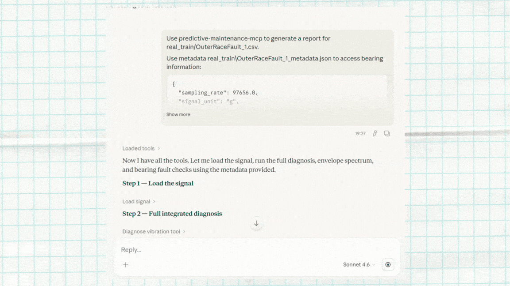
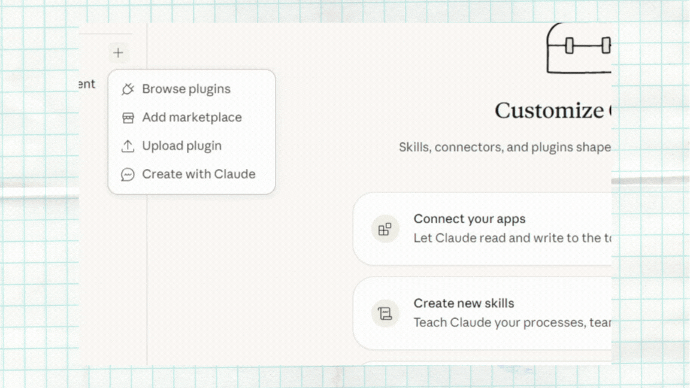
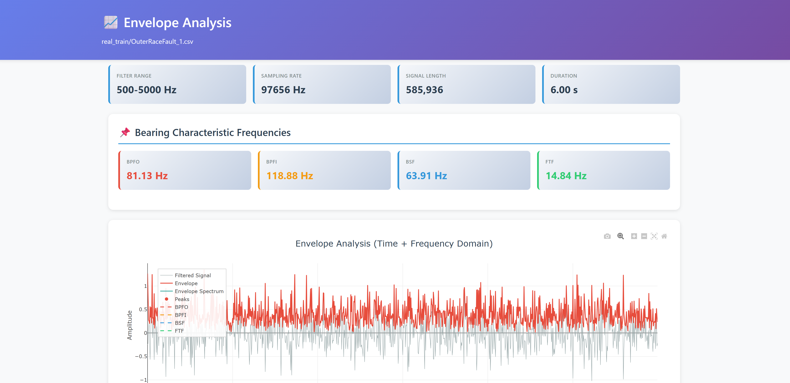
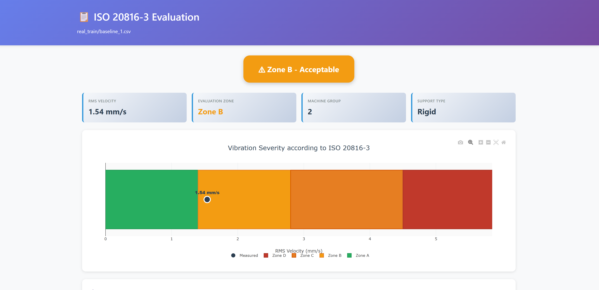

# Predictive Maintenance MCP Server

<!-- mcp-name: io.github.LGDiMaggio/predictive-maintenance-mcp -->

[](https://www.python.org/downloads/)
[](https://doi.org/10.5281/zenodo.17611542)
[](https://github.com/LGDiMaggio/predictive-maintenance-mcp/actions/workflows/tests.yml)
[](https://codecov.io/gh/LGDiMaggio/predictive-maintenance-mcp)
[](https://opensource.org/licenses/MIT)

**Give any AI assistant the ability to analyze vibration data, detect machinery faults, and generate professional diagnostic reports — through natural conversation.**

An open-source [MCP](https://modelcontextprotocol.io/) server and **predictive maintenance AI agent** that turns LLMs into condition monitoring assistants. Engineers describe what they need in plain language; the AI calls the right analysis tools and delivers results — bearing fault detection, risk assessment, anomaly detection, and remaining useful life estimation. Also available as a **Claude Code plugin** with 7 diagnostic skills. It's designed to **support and accelerate expert decision-making**.

---

## Quick Start

```bash
pip install predictive-maintenance-mcp
```

Add to your Claude Desktop config (`%APPDATA%\Claude\claude_desktop_config.json` on Windows, `~/Library/Application Support/Claude/claude_desktop_config.json` on macOS):

```json
{
  "mcpServers": {
    "predictive-maintenance": {
      "command": "predictive-maintenance-mcp"
    }
  }
}
```

Restart Claude Desktop. You're ready — try: *"Load real_train/OuterRaceFault_1.csv and check if the bearing is healthy."*

> **More options**: [install from source](INSTALL.md) · [VS Code setup](INSTALL.md) · [Docker / HTTPS deployment](docs/DEPLOYMENT.md) · [use with local LLMs (Ollama)](docs/OLLAMA_GUIDE.md)

---

## See It in Action

<p align="center">
  
</p>

<p align="center"><em>Full diagnostic workflow: load signal → spectral analysis → fault detection → severity assessment → report generation</em></p>

---

## What Can It Do?

**Upload a vibration signal → get a professional diagnosis through conversation.**

| You say | The AI does |
|---------|-------------|
| *"Is this bearing healthy?"* | Loads the signal, runs spectral analysis, checks for fault patterns, classifies severity |
| *"Generate a full diagnostic report"* | Produces an interactive HTML report with charts, fault markers, and severity assessment |
| *"Extract specs from test_pump_manual.pdf and diagnose the signal"* | Reads the equipment manual, looks up the bearing model, calculates expected fault frequencies, matches them against the signal |
| *"Train an anomaly detector on my healthy baselines, then flag anomalies"* | Trains a machine learning model on normal data, scores new signals, highlights outliers |

The AI doesn't guess — it calls **52 specialized MCP endpoints** (46 tools, 2 resources, 4 prompts) running locally on your machine. Your data never leaves your infrastructure.

<details>
<summary><b>See the full endpoint list (52 MCP endpoints: 43 tools, 1 resource, 4 prompts)</b></summary>

### Signal Acquisition (7 tools + 2 resources)

| Endpoint | Type | Description |
|----------|------|-------------|
| `load_signal` | Tool | Load vibration file (CSV, WAV, MAT, NPY, Parquet) |
| `list_signals` | Tool | Browse available signal files with metadata |
| `list_stored_signals` | Tool | List cached signals in memory |
| `get_signal_info` | Tool | Signal metadata (sampling rate, duration, stats) |
| `generate_test_signal` | Tool | Create synthetic signals for testing |
| `clear_signal` / `clear_all_signals` | Tool | Cache management |
| `signal://list` | Resource | Browse all signal files |
| `signal://read/{filename}` | Resource | Read signal metadata |

### Spectral & Statistical Analysis (10 tools)

| Tool | Description |
|------|-------------|
| `analyze_fft` | Frequency spectrum with automatic peak detection |
| `analyze_envelope` | Envelope analysis for bearing fault detection |
| `analyze_statistics` | Time-domain features (RMS, kurtosis, crest factor) |
| `compute_power_spectral_density` | Power spectral density (Welch method) |
| `compute_spectrogram_stft` | Time-frequency spectrogram |
| `extract_features_from_signal` | 17+ statistical and spectral features |
| `compute_envelope_spectrum_tool` | Envelope spectrum computation |
| `plot_signal` / `plot_spectrum` / `plot_envelope` | Visualization tools (3 tools) |

### Diagnostics & Health Assessment (14 tools)

| Tool | Description |
|------|-------------|
| `calculate_bearing_characteristic_frequencies` | Compute expected fault frequencies from bearing geometry |
| `check_bearing_fault_peak_tool` | Detect peaks at fault frequencies |
| `check_bearing_faults_direct` | Multi-fault detection (inner/outer/ball/cage) |
| `diagnose_vibration_tool` | Integrated evidence-based diagnosis pipeline |
| `search_bearing_catalog` | Look up bearing specs by model number |
| `lookup_bearing_and_compute_tool` | Catalog lookup + frequency calculation |
| `evaluate_iso_20816` | Vibration severity assessment (4 severity zones) |
| `assess_vibration_severity` | Health classification |
| `train_anomaly_model` | Train novelty detection on healthy baselines |
| `predict_anomalies` | Score new signals for anomalies |
| `search_documentation` | Semantic search over equipment manuals |
| `read_manual_excerpt` / `extract_manual_specs` | Extract specs from PDFs (2 tools) |
| `list_machine_manuals` | Browse available documentation |

### Reporting (9 tools)

| Tool | Description |
|------|-------------|
| `generate_fft_report` | Interactive frequency analysis report |
| `generate_envelope_report` | Envelope analysis with fault markers |
| `generate_iso_report` | Severity zone visualization |
| `generate_diagnostic_report_docx` | Structured Word document report |
| `generate_pca_visualization_report` | 2D/3D anomaly projection |
| `generate_feature_comparison_report` | Cross-signal feature comparison |
| `plot_iso_20816_chart` | ISO 20816 severity zone chart |
| `list_html_reports` / `get_report_info` | Report management (2 tools) |

### Prognostics (3 tools)

| Tool | Description |
|------|-------------|
| `estimate_rul` | Remaining Useful Life estimation (linear, exponential, Weibull, Kalman) |
| `analyze_signal_trend` | Trend detection on feature time series (increasing/decreasing/stable) |
| `detect_signal_degradation_onset` | Baseline deviation detection for early degradation warning |

### Decision Support (3 tools)

| Tool | Description |
|------|-------------|
| `check_vibration_alert` | ISO 10816 vibration severity alert classification (zones A/B/C/D) |
| `check_custom_vibration_alert` | Custom threshold-based vibration alerting |
| `generate_maintenance_recommendations` | Context-aware maintenance recommendations from diagnosis |

### Guided Workflows (4 prompts + 2 resources)

| Prompt | Description |
|--------|-------------|
| `diagnose_bearing` | Complete bearing fault diagnostic decision tree |
| `diagnose_gear` | Gear fault detection workflow |
| `quick_diagnostic_report` | Fast health screening |
| `generate_iso_diagnostic_report` | ISO-compliant diagnostic report generation |

</details>

---

## Claude Code Plugin

The project includes a **plugin for Claude Code** with domain-specific skills that activate automatically during conversation. Install it and Claude gains guided diagnostic workflows, autonomous agents, and quick commands.

```shell
/plugin marketplace add LGDiMaggio/predictive-maintenance-mcp
/plugin install predictive-maintenance@predictive-maintenance-marketplace
```

<p align="center">
  
</p>

<p align="center"><em>Claude Code plugin: domain skills activate automatically, slash commands for quick diagnostics</em></p>

### Skills (7) — activate automatically based on context

| Skill | What it does |
|-------|-------------|
| **bearing-diagnosis** | Walks through a complete bearing fault diagnostic workflow |
| **gear-diagnosis** | Gear fault detection via spectral pattern analysis |
| **quick-screening** | 30-second vibration health check |
| **report-generation** | Professional HTML and Word report generation |
| **anomaly-detection** | Train and run ML-based anomaly detection models |
| **signal-management** | Load, inspect, and manage vibration signals |
| **documentation-search** | Search equipment manuals and bearing catalogs |

### Agents (2) — run autonomously for complex tasks

| Agent | What it does |
|-------|-------------|
| **diagnostic-pipeline** | End-to-end: load signal → spectral analysis → fault detection → severity assessment → report |
| **signal-explorer** | Explore and compare multiple signals, find outliers, characterize patterns |

### Commands (3) — quick entry points

| Command | Example |
|---------|---------|
| `/pm-diagnose` | `/pm-diagnose bearing_signal.csv` — full fault diagnosis |
| `/pm-screen` | `/pm-screen bearing_signal.csv` — quick health check |
| `/pm-report` | `/pm-report bearing_signal.csv full` — generate all reports |

---

## Reports

All analysis tools generate **interactive HTML reports** you can open in any browser — pan, zoom, hover for details. Also supports structured Word (.docx) exports.

<details>
<summary><b>Report examples</b></summary>





| Report Type | What it shows |
|-------------|---------------|
| Frequency spectrum | Peak detection, harmonic markers |
| Envelope analysis | Bearing fault frequency matching |
| Severity assessment | Vibration health zones (ISO 20816-3) |
| Word document | Full diagnostic narrative with embedded charts |
| PCA visualization | Multi-signal anomaly clustering |
| Feature comparison | Side-by-side signal feature analysis |

</details>

---

## Sample Data Included

The project ships with **20 real bearing vibration signals** from production machinery tests — ready to use out of the box.

- **Training set**: 2 healthy baselines + 12 fault signals (inner race, outer race)
- **Test set**: 1 healthy baseline + 5 fault signals

Try: *"Load real_train/OuterRaceFault_1.csv and diagnose the bearing fault."*

Full dataset documentation: [data/README.md](data/README.md)

---

## Architecture

```
          YOU (natural language)
               │
               v
     LLM (Claude, GPT, Ollama...)
     understands intent, selects tools
               │
               v  ── Model Context Protocol ──
    ┌──────────────────────────────┐
    │    Predictive Maintenance    │
    │         MCP Server           │
    │                              │
    │  Signal Analysis    Reports  │
    │  Fault Detection    ML       │
    │  Severity Rating    RAG Docs │
    └──────────────────────────────┘
               │
               v
       YOUR DATA (stays local)
    signals · manuals · models
```

The codebase follows a **modular architecture** organized around the ISO 13374 Six-Block Diagnostic standard — signal acquisition, processing, diagnostics, prognostics, and decision support as separate sub-packages.

<details>
<summary><b>Detailed module structure</b></summary>

```
src/predictive_maintenance_mcp/
├── mcp_tools/                 # MCP endpoint registration (52 MCP endpoints)
│   ├── acquisition_tools.py   # Signal loading & management
│   ├── analysis_tools.py      # Spectral & statistical analysis
│   ├── diagnostics_tools.py   # Fault detection, ML, document search
│   ├── report_tools.py        # HTML/DOCX report generation
│   ├── prompts.py             # Guided diagnostic workflows
│   └── _utils.py              # Shared utilities
├── signal_acquisition/        # Multi-format loaders (CSV, MAT, WAV, NPY, Parquet)
├── signal_processing/         # Spectral analysis & feature extraction
├── diagnostics/               # Bearing/gear analysis, ISO standards
├── decision_support/          # Evidence-based diagnosis pipeline
├── prognostics/               # RUL estimation (linear, exponential, Weibull) & trend analysis
├── rag.py                     # Document indexing & search (FAISS/TF-IDF)
├── models.py                  # Pydantic data models
├── server.py                  # FastMCP server entry point
└── config.py                  # Configuration management
```

**Standards implemented**: ISO 13374 (diagnostic architecture), ISO 20816-3 (vibration severity classification), MIMOSA OSA-CBM (condition-based maintenance framework).

</details>

**Key design choices:**
- **Privacy-first** — raw vibration data never leaves your machine; only computed results flow to the LLM
- **LLM-agnostic** — works with Claude, ChatGPT, Microsoft Copilot Studio, or any MCP-compatible client. Use [Ollama](docs/OLLAMA_GUIDE.md) for fully air-gapped deployments
- **Modular** — use only the tools you need, extend with your own

---

## Documentation

| Guide | For |
|-------|-----|
| [Quickstart for Engineers](docs/QUICKSTART_ENGINEER.md) | Get results fast, no coding required |
| [Quickstart for Developers](docs/QUICKSTART_DEVELOPER.md) | Understand MCP, extend the server |
| [Plugin README](plugin/README.md) | Claude Code plugin installation and usage |
| [HTTPS Deployment](docs/DEPLOYMENT.md) | Docker + HTTPS for enterprise environments |
| [Ollama Guide](docs/OLLAMA_GUIDE.md) | Use with local LLMs (fully air-gapped) |
| [Architecture](docs/architecture.md) | ISO 13374 block mapping and module design |
| [Examples](EXAMPLES.md) | Complete diagnostic workflows |
| [Installation](INSTALL.md) | Detailed setup and troubleshooting |
| [Contributing](CONTRIBUTING.md) | How to contribute (all skill levels welcome) |
| [Changelog](CHANGELOG.md) | Version history |

---

## Testing

**86% test coverage** across Windows, macOS, and Linux (Python 3.11 & 3.12).

```bash
pytest                                  # run all tests
pytest --cov=src --cov-report=html      # with coverage report
```

20+ test files covering signal analysis, fault detection, severity assessment, ML models, report generation, RAG search, and real bearing fault data validation.

---

## Roadmap

- [x] 52 MCP endpoints (43 tools, 1 resource, 4 prompts) with modular architecture
- [x] Claude Code plugin (7 skills, 2 agents, 3 commands)
- [x] 86% test coverage, CI/CD on 3 platforms
- [x] Docker + SSE/HTTP transport for enterprise deployment
- [x] Semantic document search (FAISS + TF-IDF)
- [ ] Customizable severity thresholds
- [x] Remaining useful life (RUL) estimation models (linear, exponential, Weibull degradation)
- [x] Trend analysis and degradation onset detection
- [ ] Multi-signal trending and historical comparison
- [ ] Real-time streaming (MQTT/Kafka)
- [ ] Fleet dashboard for multi-asset monitoring
- [ ] CMMS integration (SAP, Maximo, Infor)

> Ideas? [Open a discussion](https://github.com/LGDiMaggio/predictive-maintenance-mcp/discussions) or [create an issue](https://github.com/LGDiMaggio/predictive-maintenance-mcp/issues/new/choose).

---

## Related

**[claude-stwinbox-diagnostics](https://github.com/LGDiMaggio/claude-stwinbox-diagnostics)** — Extends this project by connecting a physical edge sensor (STEVAL-STWINBX1) to Claude via MCP, with Claude Skills for guided condition monitoring. Same analysis engine, real hardware, operator-friendly reports.

---

## Contributing

Contributions welcome from **everyone** — not just programmers. Domain experts, technical writers, and testers are equally valued. See [CONTRIBUTING.md](CONTRIBUTING.md) for paths tailored to your background.

**Quick start**: browse [Issues](https://github.com/LGDiMaggio/predictive-maintenance-mcp/issues) for `good first issue` or `help wanted` labels.

---

## Citation

```bibtex
@software{dimaggio_predictive_maintenance_mcp_2025,
  title   = {Predictive Maintenance MCP Server},
  author  = {Di Maggio, Luigi Gianpio},
  year    = {2025},
  version = {0.8.0},
  url     = {https://github.com/LGDiMaggio/predictive-maintenance-mcp},
  doi     = {10.5281/zenodo.17611542}
}
```

## License

MIT — see [LICENSE](LICENSE). Sample data is CC BY-NC-SA 4.0 (non-commercial); for commercial use, replace with your own machinery data.

## Acknowledgments

[FastMCP](https://github.com/jlowin/fastmcp) framework · [Model Context Protocol](https://modelcontextprotocol.io/) by Anthropic · Sample data from [MathWorks](https://github.com/mathworks/RollingElementBearingFaultDiagnosis-Data) · Core development assisted by [Claude](https://claude.ai)

---

*An open-source predictive maintenance AI agent and condition monitoring copilot — built to support reliability engineers and the developer community.*
