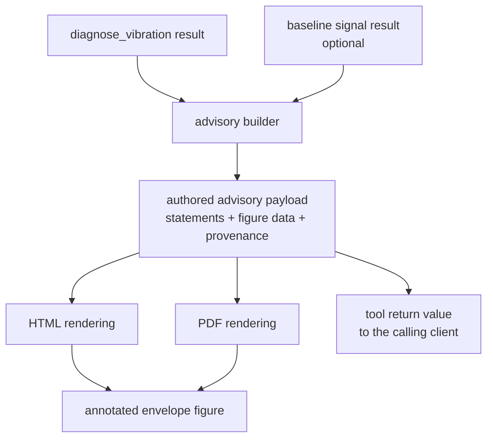

# feat: Integrated diagnostic report with server-authored advisory

## Summary

Build a server-authored advisory layer on top of the existing `diagnose_vibration` pipeline, then render it as one integrated report in two formats (self-contained HTML and PDF) with an annotated envelope spectrum as the explanatory figure. The implementation extends the existing synthesis engine rather than adding a parallel one, and moves report content authorship from the caller to the server.

---

## Problem Frame

The server already runs a cross-tool diagnosis (`diagnose_vibration` in `src/decision_support/diagnosis_pipeline.py`) but has no renderer for its integrated result — the HTML reports are one per analysis tool, and the only integrated output is DOCX. That DOCX tool takes a caller-supplied `sections` dict including a free-text `diagnosis` string, so the report's evaluative content is authored by whoever calls it, not by the server that computed it. The origin document records what that costs when the caller is an LLM: faithful numbers presented under invented labels, with a mandatory standards caveat silently dropped.

---

## Assumptions

*This plan was authored in pipeline mode without synchronous user confirmation. The items below are agent inferences that fill gaps in the origin document — un-validated bets that should be reviewed before implementation proceeds.*

- The new capability is exposed as **one new MCP tool** rather than by changing an existing tool's signature. This grows the frozen surface from 33 to 34 tools and requires a deliberate inventory-fixture regeneration (see U5). The alternative — folding multi-format output into `generate_diagnostic_report_docx` — would break backward compatibility on a minor version, which the project's invariants forbid.
- `generate_diagnostic_report_docx` is **left in place unchanged**. Its caller-authored `sections` contract is the pattern this plan moves away from, but changing it is a breaking change and belongs in a follow-up.
- The existing `evidence_strength` value (`none`/`weak`/`moderate`/`strong`, computed in `_synthesize_diagnosis`) is the correct thing to surface and is **not** a confidence score. The report renders it with its own vocabulary and states how it accumulates, so a reader cannot mistake it for a probability. This is the most likely origin of the observed "Confidence: high" chip.
- Baseline association is by **explicit caller argument** (a second stored signal id), not by convention or metadata lookup. The origin document deferred this question; explicit is the reversible choice.
- PDF is produced from the same authored content via an optional extra, following the existing `HAS_DOCX` pattern. It is sequenced last so a CI failure in the new dependency cannot block the rest.

---

## Requirements

- R1. Every evaluative statement in the report is authored by the server as a complete string.
- R2. No confidence score or label is emitted; evidential strength is conveyed by listing supporting facts.
- R3. The server returns authored statements plus figure data, not only a file path and summary.
- R4. Callers reuse the server's statements and do not coin standards, classes, zones, or confidence levels.
- R5. One document covers signal overview, ISO severity, anomaly state, characteristic-frequency matching, spectral energy, and actions.
- R6. Disagreeing indicators are stated explicitly, with the one that governs the action named.
- R7. Every recommendation carries its motivation and names its evidence.
- R8. Comparison against a healthy baseline signal when available, expressed as deltas.
- R9. Missing inputs are stated along with the conclusion they make unavailable, not silently omitted.
- R10. Annotated envelope spectrum with characteristic-frequency lines and tolerance band; readable statically.
- R11. Figures that close no reasoning are excluded.
- R12. Two renderings from the same authored content, both self-contained, carrying identical statements.
- R13. Same signal and parameters produce the same document apart from timestamp.
- R14. Provenance carried in the document: source signal, analysis parameters, server version.
- R15. The conversational reading layer introduces no assertion absent from the document.

**Origin actors:** A1 (maintenance technician), A2 (evaluating stakeholder), A3 (analyst), A4 (client LLM)
**Origin flows:** F1 (produce a bearing diagnosis of record), F2 (read and interrogate the diagnosis)
**Origin acceptance examples:** AE1 (covers R6), AE2 (covers R8, R9), AE3 (covers R9), AE4 (covers R1, R4), AE5 (covers R13), AE6 (covers R2)

---

## Scope Boundaries

- Existing per-tool HTML reports (`generate_fft_report`, `generate_envelope_report`, `generate_iso_report`) and `generate_diagnostic_report_docx` are not modified.
- Diagnostic paths other than rolling-element bearing faults.
- Multi-acquisition trending, historical evolution, and RUL presentation.
- Fleet or multi-machine views.
- Restyling the existing HTML templates as an end in itself.

### Deferred to Follow-Up Work

- Migrating `generate_diagnostic_report_docx` to server-authored content: breaking signature change, separate major-version PR.
- Adding the annotated-figure treatment to the standalone envelope report: separate PR once the figure builder proves out.
- Raising coverage on `src/html_templates.py` and `src/report_generator.py`, currently excluded in `pyproject.toml`: separate PR.

---

## Context & Research

### Relevant Code and Patterns

- `src/decision_support/diagnosis_pipeline.py` — `diagnose_vibration` already orchestrates FFT, PSD, STFT, bearing checks, ISO severity, and anomaly detection; `_synthesize_diagnosis` already produces statement lines, recommendation strings, and a categorical evidence strength. This is the extension point, not a thing to duplicate.
- `src/decision_support/recommendations.py` — `generate_recommendations` is already server-authored and already refuses a confidence input. Its `{action, urgency, description}` shape is the model for the advisory payload.
- `src/diagnostics/iso20816.py` — single source of zone boundaries and the mandatory standards caveat string. The report must render that string, never a paraphrase.
- `src/report_generator.py` — `save_*_report` functions, `timestamped_report_name`, and the `HAS_DOCX` optional-dependency guard pattern to mirror for PDF.
- `src/html_templates.py` — `get_base_template` plus per-report builders; the new integrated template joins this module.
- `src/path_safety.py` — `safe_resolve` guards all report writes.
- `tests/test_tool_inventory.py`, `tests/test_surface_parity.py` — the MCP surface is frozen at 33 tools / 0 resources / 3 prompts. Both must be updated deliberately when U5 lands.
- `tests/test_error_contract.py` — failures raise, never return error-shaped dicts.

### Institutional Learnings

- `docs/solutions/architecture-patterns/`, `docs/solutions/security-issues/` — reviewed for report-path and standards-labelling precedent before implementing U4 and U6.

---

## Key Technical Decisions

- **Extend `_synthesize_diagnosis` output rather than write a second reasoning path.** Two engines producing statements about the same signal is exactly the divergence the origin document is trying to eliminate (see origin: `docs/brainstorms/2026-08-06-diagnostic-report-value-and-authorship.md`).
- **The advisory payload is the single source of report content; both renderings consume it.** HTML and PDF never compose their own text. This is what makes R12's "identical statements" testable rather than aspirational.
- **Determinism is asserted on content, not filenames.** `timestamped_report_name` deliberately appends a timestamp and a monotonic sequence so re-runs never overwrite. R13 is therefore tested by comparing rendered bodies with provenance timestamps excluded.
- **Missing inputs produce authored refusal statements, not absent sections.** This mirrors the existing `_refused_iso_block` pattern in the pipeline, which already returns `status`/`reason`/`remedy` instead of dropping the block.
- **Evidence strength is rendered with its accumulation rationale attached.** Showing `strong` without saying it counts corroborating independent findings is what invites a reader — or a model — to reinterpret it as a probability.

---

## Open Questions

### Resolved During Planning

- How the authored content reaches the caller: as part of the new tool's return value, alongside the file paths. Adding an MCP resource is ruled out — the surface deliberately dropped all resources at v0.9.0.
- Whether both renderings are always emitted: the tool takes a formats argument defaulting to both, so a caller that only wants HTML pays nothing for PDF.
- Baseline association: explicit caller-supplied signal id (see Assumptions).

### Deferred to Implementation

- Which PDF backend to use, and whether it can render the annotated figure without a headless-browser dependency. Decided in U6 against the actual figure output.
- Whether the annotated spectrum is best produced as a static image embedded in both renderings, or as Plotly in HTML plus a static export in PDF. Depends on what the PDF backend accepts; R12 constrains the outcome, not the mechanism.
- Exact set of indicator disagreements worth authoring beyond the ISO-versus-anomaly case. Discovered by running U1 against the real signals in `data/signals/real_train/`.

---

## High-Level Technical Design

> *This illustrates the intended approach and is directional guidance for review, not implementation specification. The implementing agent should treat it as context, not code to reproduce.*

The advisory payload is the only place evaluative text is written. Everything downstream of it — both file renderings and the value handed back to the client — reads the same authored strings, which is what makes "no claim in one that is absent from the other" checkable.

---

## Implementation Units

### U1. Server-authored advisory builder

**Goal:** Turn a `diagnose_vibration` result into a structured set of server-authored statements: verdict, standard label with its caveat, evidence statements, indicator-disagreement reconciliation, and recommendations each carrying its motivation.

**Requirements:** R1, R2, R6, R7, R9

**Dependencies:** None

**Files:**
- Create: `src/decision_support/advisory.py`
- Modify: `src/decision_support/__init__.py`
- Test: `tests/test_advisory.py`

**Approach:**
- Consume the dict returned by `diagnose_vibration`; do not re-run analysis.
- Reuse `generate_recommendations` for the action set and attach to each action the evidence statement that justifies it, rather than inventing a parallel recommendation ladder.
- Render the ISO block by reading the standards string owned by `src/diagnostics/iso20816.py`; never format a standard name locally.
- Add reconciliation logic for disagreeing indicators — the ISO-zone-acceptable versus high-anomaly-ratio case first — producing an authored statement that names which indicator governs the recommended action.
- Where the pipeline returned a refusal block (`status: "refused"`), carry its `reason` and `remedy` into an authored statement rather than dropping the section.
- Emit evidence strength together with a sentence describing what it counts. No field named or valued as a confidence.

**Execution note:** Implement test-first. The authorship rules are assertions about output content, and writing them first is what keeps the vocabulary from drifting during implementation.

**Patterns to follow:**
- `src/decision_support/recommendations.py` — closed vocabulary, explicit `ValueError` on unknown input, docstring stating what is deliberately not accepted.
- `src/decision_support/diagnosis_pipeline.py` `_refused_iso_block` — the `status`/`reason`/`remedy` refusal shape.

**Test scenarios:**
- Happy path: a result with a detected outer-race fault yields a verdict statement naming the fault, an evidence list including the frequency match and its deviation, and at least one recommendation carrying a motivation string.
- Happy path: the ISO statement contains the standards caveat string exactly as `iso20816` publishes it.
- Covers AE1. Edge case: ISO zone B with anomaly ratio 1.0 produces an explicit disagreement statement naming which indicator governs the action.
- Covers AE6. Edge case: a strongly-corroborated result exposes no field whose name or value reads as a confidence or probability; evidence strength is accompanied by its accumulation description.
- Covers AE3. Error path: a result with no bearing block produces an authored statement that matching was not attempted and why, not an absent section.
- Error path: a result whose ISO block is a refusal carries the pipeline's `reason` and `remedy` verbatim into the advisory.
- Edge case: a clean signal with no findings yields a "no fault evidence" verdict and a monitoring recommendation, with no fault-specific actions.

**Verification:**
- Every string in the advisory payload originates in this module, `recommendations.py`, `iso20816.py`, or the pipeline — no evaluative text is expected from a caller.
- A grep of the module finds no occurrence of the word "confidence" outside a docstring that explains its absence.

---

### U2. Baseline comparison

**Goal:** Express the key indicators as deltas against a healthy baseline signal when one is supplied, and state the absence explicitly when one is not.

**Requirements:** R8, R9

**Dependencies:** U1

**Files:**
- Modify: `src/decision_support/advisory.py`
- Test: `tests/test_advisory.py`

**Approach:**
- Accept an optional second diagnosis result (the baseline) and compute deltas on the indicators a technician acts on: RMS velocity, anomaly ratio, and envelope energy at the matched characteristic frequency.
- Author the comparison as statements, not as a bare number table — a delta without a sentence saying what it means is the mute-data failure the origin document is targeting.
- When no baseline is supplied, emit the authored absence statement from U1's refusal shape rather than skipping the block.
- Guard against comparing incompatible signals (different sampling rate, different declared unit) with an explicit refusal statement.

**Patterns to follow:**
- U1's authored-refusal shape for the no-baseline and incompatible-baseline cases.

**Test scenarios:**
- Happy path: a faulted signal compared against `baseline_1` yields a delta statement on RMS velocity with direction and magnitude.
- Covers AE2. Edge case: no baseline supplied yields a present comparison block stating the absence and the conclusion it makes unavailable.
- Error path: a baseline with a different declared signal unit yields a refusal statement naming the mismatch, not a computed delta.
- Edge case: a baseline identical to the signal yields near-zero deltas and a statement that no change was observed, not an empty block.

**Verification:**
- Running the advisory against `data/signals/real_train/OuterRaceFault_1.csv` with `baseline_1.csv` produces deltas; running it without a baseline produces the absence statement.

---

### U3. Annotated envelope spectrum figure

**Goal:** Produce the explanatory figure — envelope spectrum with BPFO/BPFI/BSF/FTF lines overlaid and the tolerance band shaded — such that the match is visible without interaction.

**Requirements:** R10, R11

**Dependencies:** U1

**Files:**
- Create: `src/figures.py`
- Test: `tests/test_figures.py`

**Approach:**
- Build the figure from the envelope spectrum and the characteristic frequencies already computed by the pipeline's bearing block; do not recompute either.
- Annotate each characteristic frequency with its label and draw the tolerance band used by the matching logic, so the reader sees the same tolerance the verdict used.
- Keep annotation in the figure itself rather than in a legend — the point must survive a static export for the PDF rendering.
- Degrade to a plain annotated envelope spectrum when no bearing metadata is available, consistent with U1's authored absence statement.

**Patterns to follow:**
- `src/html_templates.py` chart construction for Plotly figure assembly conventions.

**Test scenarios:**
- Happy path: with bearing metadata present, the figure data contains one annotated marker per characteristic frequency and a shaded band whose width matches the matching tolerance.
- Edge case: with no bearing metadata, the figure is produced without characteristic-frequency annotations and does not raise.
- Edge case: a characteristic frequency above the plotted range is omitted from annotations rather than drawn off-axis.
- Happy path: the annotation text for the matched frequency includes both the calculated and the measured value.

**Verification:**
- The figure exported statically still shows which band the dominant peak falls into.

---

### U4. Integrated HTML rendering

**Goal:** Render the advisory payload as one self-contained HTML document covering the whole bearing case, carrying provenance.

**Requirements:** R5, R12, R13, R14

**Dependencies:** U1, U2, U3

**Files:**
- Modify: `src/html_templates.py`
- Modify: `src/report_generator.py`
- Test: `tests/test_reports.py`

**Approach:**
- Add an integrated report template alongside the existing per-analysis builders, consuming only the advisory payload and the figure from U3.
- The template places text; it does not compose text. Any string it renders comes from the payload.
- Include a provenance block: source signal id and path, analysis parameters, and server version.
- Reuse `timestamped_report_name` and the existing `safe_resolve` write path so the new report inherits the non-overwriting and path-safety behavior.

**Patterns to follow:**
- `src/report_generator.py` `save_iso_report` — signature shape, metadata embedding, and return dict.
- `src/html_templates.py` `get_base_template` — the embedded-metadata script block.

**Test scenarios:**
- Happy path: the rendered document contains the verdict, the ISO statement with its caveat, the disagreement statement when present, and every recommendation from the payload.
- Covers AE4. Happy path: every evaluative sentence in the rendered output appears verbatim in the advisory payload.
- Covers AE5. Integration: rendering the same payload twice produces byte-identical bodies once provenance timestamps are excluded.
- Edge case: a payload containing authored absence statements renders those sections rather than omitting them.
- Integration: the report writes under the configured reports directory and a traversal-shaped signal label cannot escape it.
- Happy path: the provenance block names the source signal, the parameters, and the server version.

**Verification:**
- Opening the generated file with no server running shows the complete diagnosis, including figures.

---

### U5. MCP tool surface

**Goal:** Expose the integrated report as a tool that returns both the authored statements and the written file paths, and state the authorship rule where callers will read it.

**Requirements:** R3, R4, R15

**Dependencies:** U4

**Files:**
- Modify: `src/mcp_tools/report_tools.py`
- Modify: `src/server.py`
- Modify: `tests/fixtures/tool_inventory.json`
- Test: `tests/test_report_tools.py`, `tests/test_tool_inventory.py`, `tests/test_surface_parity.py`

**Approach:**
- Add one tool taking a signal id, the diagnosis inputs the pipeline already needs, an optional baseline signal id, and a formats argument defaulting to both renderings.
- The return value carries the authored statements alongside the file paths — this is what closes the gap that left previous callers inventing content.
- The tool's docstring states that the returned statements are to be reused verbatim and that standards names, machine classes, zones, and confidence levels are not to be coined by the caller.
- Extend the server's existing evidence-based inference policy with the same rule, so it reaches clients that read the server instructions rather than the tool docstring.
- Regenerate `tests/fixtures/tool_inventory.json` using the documented snapshot recipe and update the frozen count in `tests/test_surface_parity.py` from 33 to 34, with a fixture-history note recording why.

**Execution note:** Regenerate the inventory fixture with the recipe in the `tests/test_tool_inventory.py` docstring — never hand-edit it.

**Patterns to follow:**
- `src/mcp_tools/report_tools.py` `generate_diagnostic_report_docx` — signal-handle validation via `resolve_signal`, `ctx.info` progress reporting, return dict shape. Follow its structure, not its caller-authored `sections` contract.
- `tests/test_tool_inventory.py` fixture-history docstring — the convention for recording an intentional surface change.

**Test scenarios:**
- Happy path: calling the tool on a loaded signal returns authored statements and one file path per requested format.
- Error path: an unknown signal id raises rather than returning an error-shaped dict.
- Edge case: requesting only the HTML format produces one file and no PDF path.
- Covers AE4. Integration: the statements in the return value match those rendered in the written file.
- Integration: the registered surface counts 34 tools, and the inventory fixture matches the live registration.
- Happy path: the tool docstring states the caller-authorship prohibition.

**Verification:**
- Full test suite passes, including the inventory and parity tests, with the surface change recorded intentionally rather than silenced.

---

### U6. PDF rendering

**Goal:** Produce the PDF deliverable from the same advisory payload, behind an optional dependency.

**Requirements:** R12, R13

**Dependencies:** U4

**Files:**
- Modify: `src/report_generator.py`
- Modify: `pyproject.toml`
- Test: `tests/test_reports.py`

**Approach:**
- Add a `pdf` optional extra and an availability guard mirroring the existing `HAS_DOCX` pattern; a missing dependency raises with an install hint, consistent with the DOCX path.
- The PDF renderer consumes the same payload as the HTML renderer. Choose a backend that does not require a headless browser if the figure export allows it; decide against the real U3 output.
- Add the extra to the `full` aggregate extra.

**Patterns to follow:**
- `src/report_generator.py` `HAS_DOCX` guard and the `save_diagnostic_report_docx` missing-dependency error message.

**Test scenarios:**
- Happy path: with the extra installed, a PDF is produced and is non-empty.
- Error path: with the extra absent, requesting the PDF format raises with an install hint naming the extra.
- Covers AE5. Integration: two renderings of the same payload produce identical extracted text once provenance timestamps are excluded.
- Integration: the PDF contains the same verdict, ISO statement, and recommendations as the HTML rendering of the same payload.

**Verification:**
- The parity test between the two renderings passes on a real signal from `data/signals/real_train/`.

---

### U7. Cross-rendering parity and documentation

**Goal:** Pin R12's "identical statements" guarantee as an executable test, and document the new capability.

**Requirements:** R12, R13, R14

**Dependencies:** U5, U6

**Files:**
- Test: `tests/test_reports.py`
- Modify: `README.md`, `CHANGELOG.md`
- Modify: `docs/` tool documentation

**Approach:**
- Add a parity test that extracts every authored statement from both renderings and asserts set equality — this is the test that makes the authorship boundary a guarantee rather than a convention.
- Document the new tool with its input and output shape, and state the authorship rule in user-facing documentation, not only in the docstring.
- Record the surface change (33 to 34 tools) and the new optional extra in `CHANGELOG.md`.

**Test scenarios:**
- Integration: the set of authored statements extracted from the HTML rendering equals the set extracted from the PDF rendering.
- Integration: a statement present in the advisory payload but absent from either rendering fails the test.

**Verification:**
- Documentation describes the tool and its authorship contract; the changelog records the surface and dependency changes.

---

## System-Wide Impact

- **Interaction graph:** the advisory builder sits between `diagnose_vibration` and the report layer. Nothing existing calls it, so the blast radius is confined to the new tool until the DOCX migration is taken up separately.
- **Error propagation:** failures raise per `tests/test_error_contract.py`. Missing *inputs* are not failures — they become authored absence statements, which is a deliberate distinction from missing *dependencies*, which raise.
- **State lifecycle risks:** report writes are non-overwriting by construction; a partially-written PDF on a backend failure must not leave a truncated file presented as complete.
- **API surface parity:** the frozen inventory and parity tests both encode the tool count and must be updated in the same unit that adds the tool, or CI fails at U5.
- **Integration coverage:** the cross-rendering parity test in U7 is the only place where "both renderings carry identical statements" is actually proven; unit tests on either renderer alone cannot establish it.
- **Unchanged invariants:** existing report tools, their signatures, and their outputs are untouched. `iso20816` remains the single source of zone boundaries — this plan reads it and never redefines thresholds.

---

## Risks & Dependencies

| Risk | Mitigation |
|------|------------|
| A new PDF dependency breaks CI or is unavailable on a target platform | Optional extra behind an availability guard, sequenced last; the HTML rendering and every unit before U6 land independently |
| The frozen tool inventory fails CI when the new tool registers | U5 regenerates the fixture with the documented recipe and updates the parity count in the same unit, with the reason recorded in the fixture history |
| The advisory layer duplicates reasoning already in `_synthesize_diagnosis` and the two drift | U1 consumes the pipeline result and reuses `generate_recommendations`; it does not re-derive verdicts |
| Evidence strength is re-read downstream as a confidence, reproducing the failure this work exists to fix | Rendered with its accumulation description attached; U1 asserts no confidence-shaped field exists |
| Determinism is asserted on filenames and fails spuriously | R13 is tested on rendered content with provenance timestamps excluded; filenames are intentionally unique |
| Coverage gate at 85% fails because new report code lands in currently-excluded modules | New logic goes in `src/decision_support/advisory.py` and `src/figures.py`, which are not excluded; only template rendering touches the excluded modules |

---

## Documentation / Operational Notes

- `README.md` tool list and the docs site need the new tool and its authorship contract.
- `CHANGELOG.md` records a surface addition (33 to 34 tools) and a new optional extra under the next minor version — additive only, no breaking change.
- Installing the PDF extra is required for the second rendering; the tool raises with an install hint when it is absent.

---

## Sources & References

- **Origin document:** [docs/brainstorms/2026-08-06-diagnostic-report-value-and-authorship.md](docs/brainstorms/2026-08-06-diagnostic-report-value-and-authorship.md)
- Related code: `src/decision_support/diagnosis_pipeline.py`, `src/decision_support/recommendations.py`, `src/diagnostics/iso20816.py`, `src/report_generator.py`, `src/html_templates.py`
- Surface constraints: `tests/test_tool_inventory.py`, `tests/test_surface_parity.py`
